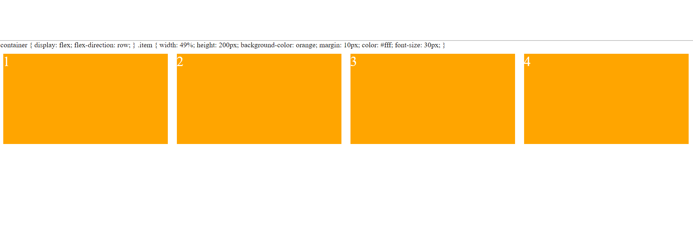

# flex

## 容器属性一览

- flex-direction:row(默认)|row-reverse|column|column-reverse
- flex-wrap:nowrap(默认) | wrap | wrap-reverse;
- flex-flow:flex-direction 和 flex-wrap 的简写，默认为 row 和 nowrap
- justify-content:flex-start(默认)|flex-end|center|space-between|space-around
- align-items:align-items: flex-start | flex-end | center | baseline | stretch;
- align-content:flex-start | flex-end | center | space-between | space-around | stretch;

### flex-direction

排列方向

1. row(默认)
   容器中的子项从左到右排列，起始位置为左边

   

2. row-reverse

   容器中的子项从右到左排列，起始位置为右边。

   

3. column

   容器中的子项从上到下排列，起始位置为上边。

   

4. column-reverse

容器中的子项从下排列，最后一个子项要碰到上沿，即结束位置为上沿。猜想:原因可能是因为浏览器有无线的下拉空间，从最低的位置开始不符合人的浏览习惯。


### flex-wrap

是否换行

1. no-wrap

无论宽，不换行，将容器均分给子项



2. wrap

换行，按规定的宽度走


3. wrap-reverse

换行，按规定的宽度走，但是第一行在下方。


### flex-flow

flex-direction 和 flex-wrap 的简写，默认为 row 和 nowrap

### justify-content

水平对齐方式

1. flex-start

   左对齐
   

2. flex-end

   右对齐


3. center
   居中对齐
   
4. space-between

两端对齐，将多的宽平分给子项目的间隔。最开始的最后的一个子项在左沿和右沿


5. space-around

居中对齐，将多的宽平分给子项目的间隔


### align-items

垂直对齐方式

1. flex-start
   上对齐
   

2. flex-end

   下对齐


3. center
   居中对齐
   

4. baseline

   第一行文字线对齐


5. stretch
   默认，如果容器中的某一个子项目没有设置高，那么将其高补齐为项目中最高子项目的高。如果均没有设置高，那么子项目高对齐为子项目中文字的高度。


### align-content

##### 子项目在容器中的垂直对齐方式，前提是要有多条轴线:容器有宽高，并且使用了换行

1. flex-start

   对齐容器的上沿

   

2. flex-end

   对齐容器的下沿

   

3. center

   位于容器的中间

   

4. space-between

   上下两端对齐，紧挨上沿和下沿

   

5. space-around

   上下两端对齐，平分间隔

   

6. stretch

   填充占满整个容器


## 子项属性一览

- order
- flex-grow
- flex-shrink
- flex-basis
- flex
- align-self

### order

排列顺序，数字越小，排列靠前，默认都为 0


### flex-grow

项目所占的宽的比例，默认都为 0

### flex-shrink

项目所占宽的缩小比例，默认都为 1.如果所有项目的 flex-shrink 属性都为 1，当空间不足时，都将等比例缩小。如果一个项目的 flex-shrink 属性为 0，其他项目都为 1，则空间不足时，前者不缩小。

### flex-basis

flex-basis 属性定义了在分配多余空间之前，项目占据的主轴空间（main size）。浏览器根据这个属性，计算主轴是否有多余空间。它的默认值为 auto，即项目的本来大小。

### flex

flex 属性是 flex-grow, flex-shrink 和 flex-basis 的简写，默认值为 0 1 auto。后两个属性可选。
该属性有两个快捷值：auto (1 1 auto) 和 none (0 0 auto)。

建议优先使用这个属性，而不是单独写三个分离的属性，因为浏览器会推算相关值。

### align-self

align-self 属性允许单个项目有与其他项目不一样的对齐方式，可覆盖 align-items 属性。默认值为 auto，表示继承父元素的 align-items 属性，如果没有父元素，则等同于 stretch。

```css
.item {
  align-self: auto | flex-start | flex-end | center | baseline | stretch;
}
```
