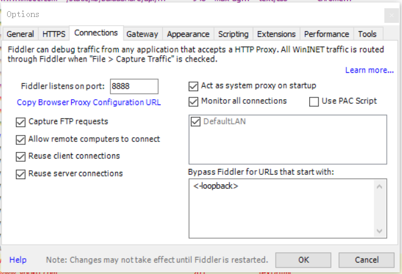

# 使用Fiddler抓取微信饿了么小程序数据

## 准备

- 一部装载Android 7.0以下的手机：此处使用华为荣耀5x
- 微信小程序7.0以下版本:此处为6.6.7。此处可通过豌豆荚应用下载。
- 安装好的Fiddler软件
- 良好的`wifi`

## 步骤

1. 将手机号电脑连接至同一`wifi`

2. 配置Fiddler

   

3. 手机wifi设置代理

   （1）选择当前连接的wifi，进入修改wifi

   （2）主机名为电脑的ip地址，通过`ipconfig`可以查看到

   （3）端口为connections中设置的端口号

4. 手机安装证书

   （1）电脑打开Fiddler软件之后，使用手机访问`主机名:端口号`,将进入fiddler证书下载页面，点击下载证书

   

（2）手机进入wifi高级设置，选择安装证书

（3）选择下载证书所在位置，选择用途为vpn和应用

5. 打开微信小程序饿了么，即可抓取数据

## Q-A

###  为什么要使用Android 7.0以下的手机和7.0以下的微信小程序版本？

参考 : [听说安卓微信 7.0 不能抓 https? · TesterHome](https://testerhome.com/topics/17746)

2019/09/14 10:19

