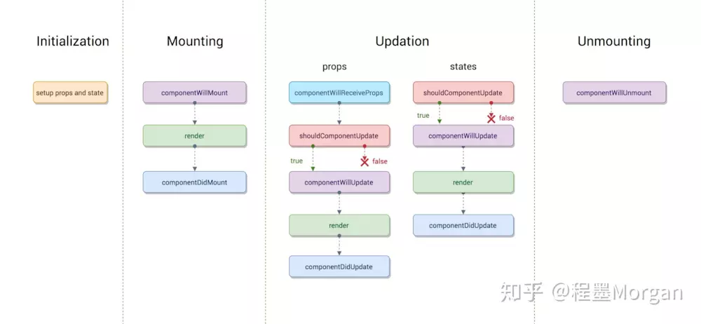
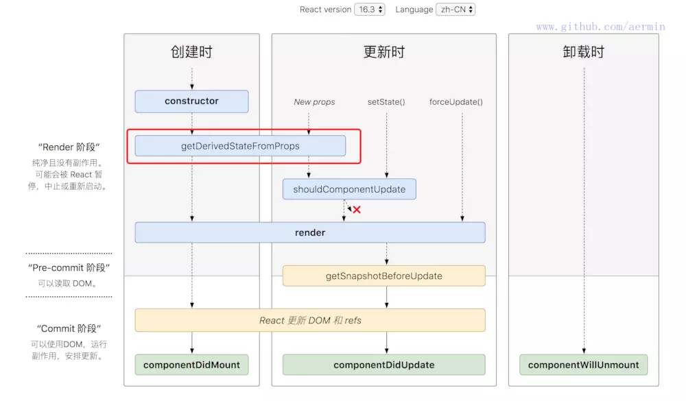

# 生命周期

> 正如人的生老病死一样，组件从创建到销毁也要经历一些特殊的阶段。官方给我们提供了一些方法，让我们可以在组件的这些阶段中添加自己的代码。

## 一、生命周期示意图
react `v15`



react `v16.3`



react `v16.4`


参考:[React lifecycle methods diagram](http://projects.wojtekmaj.pl/react-lifecycle-methods-diagram/)

### 二、详解生命周期(以`react15`版本为例)

一、初始化阶段

- `getDefaultProps`

  在组件挂载之前调用，且只会调用一次，在组件中赋值的数据会被设置到this.props中

- `getIntitialState`

  在组件挂载之前使用，且只会调用一次，函数的返回值会被设置到this.state中

二、挂载阶段

- `componentWillMount`

  组件被挂载在`dom`中使用，只会调用一次。，在render方法之前。这里使用`this.setState`不会引起组件的重新渲染。可以在这里进行普通变量的初始化赋值。

- render

  render不负责组件的渲染，它只会返回一个ui给react,让react去渲染
PS:注意这里，触发render函数只是构建了ui，至于如何去渲染,有react决定

- `componentDidMount`

  组件挂载在`dom`后使用，只会调用一次。可以获取`dom`操作。这里使用`this.state`会引用重新渲染。`http`请求可以放在这里。

三、更新阶段

- `componentWillReceiveProps:function(nextProps)`

  传入props时引起的组件更新,`nextProps`指的是传入的props。如果我们要在这里要根据prop更新state,记得先将`nextProps`与`this.props`比较，确认二者不同再更新。
PS: 如果涉及到在子组件中使用nextProps接收父组件传递的值更新状态，又在子组件中给父组件传递更新状态时，一定要进行if比较操作，否则可能会不断render组件，直至浏览器内存耗尽，陷入死循环。
 ```js
//    基础数据类型比较
  if(this.props.data!==nextProps.data){
    this.statState({data:nextProps.data})
}
//    引用数据类型比较
if(JSON.stringify(nextProps.data) !== this.props.data){
    this.setState({
        data:nextProps.data
    })
}
 ```
- `shouldComponentUpdate`

  在组件重新渲染之前调用，可以返回一个true或者false来决定组件是否要刷新。

- `componentWillUpdate`

- `componnentDidUpdate`

  组件重新渲染之后调用

四、卸载阶段

- `componentWillUnmount`

  组件卸载和销毁之前调用，在这里我们可以清理数据、状态和事件。比如某些操作会产生浏览器缓存，我们可以在这里将浏览器缓存清理掉。


