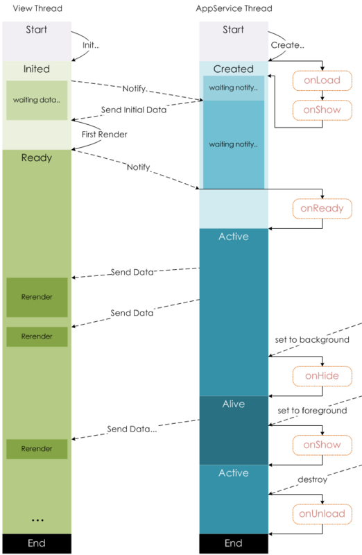

# 生命周期

## 示意图



## onLoad

页面加载时触发，一个页面可以触发一次，在这个阶段我们可以：

- 请求接口
- 获取 wx.navigateTo 和 wx.redirecTo 以及中的查询参数

```
//url wxml页面
<button bindtap='clickme'>点击跳转到生命周期页</button>

//url页面点击按钮跳转(js）
clickme:function(){
    wx.navigateTo({
      url:'../lifeperiod/lifeperiod?id=10086'
    })
  }

//lifeperiod页面获取当前页面参数(js）
onLoad: function (option) {
    console.log(option.id)
  },
```

## onShow

页面显示/切入前台时触发，其比 onReady 先触发

## onReady

页面初次渲染完成时触发。一个页面只会调用一次，代表页面已经准备妥当，可以和视图层进行交互

## onHide

页面隐藏/切入后台时触发。 如 navigateTo 或底部 tab 切换到其

## onUnload

页面卸载时触发。如 redirectTo 或 navigateBack 到其他页面时。 从 lifeperiod 页面返回 url 页面，会触发 lifeperiod 页面的 onUnload。
