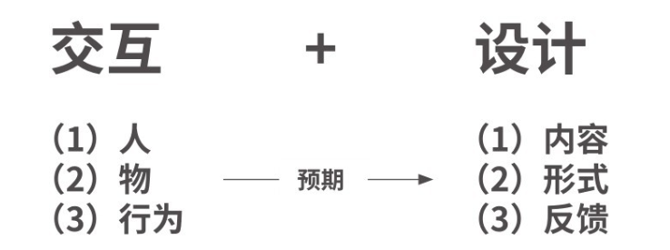

# 从需求到产品：0岁产品经理进阶之道

## 第1章 想入行?请先这样做

1. 产品经理的职责（解决问题）
   - 充分了解行业，挖掘需求并寻找产品价值；
   - 把产品概念通过良好的体验设计，转化成商品化的产品和解决方案，从而让产品被市场接受；
   - 使产品长期保持竞争力，最终给公司带来价值。
2. 产品经理的核心技能：解决问题
3. 产品的工作流程
   - 产品定位
   - 需求对接
   - 需求评审
   - 产品设计
   - 组织协调
   - 研发测试
   - 上线运营
   - 市场推广
4. 对于体验的细节的看法：锦上添花，而非雪中送炭。
5. 产品经理的基本工作职责
   - 掌握基本的工作技能
   - 理解从需求挖掘到产品上线的过程
   - 积累大量的案例并学会总结
   - 理解从需求挖掘到产品上线的过程
   - 积累大量的案例并学会总结
   - 严谨地分析问题
   - 发现市场的空缺、竞品的差异
   - 挖掘到有价值的切入点后，找到解决问题的方案
   - 完成方案后，还要通过数据分析、用户反馈等方式来验证方案
   - 利用团队资源实现产品目标

## 第2章 找到问题，并解决它

1. 需求分析：问题就是需求，想办法解决问题。

2. 产品经理的工作核心就是挖掘需求，并设计出一个解决需求的产品（或功能），之后设法整合公司内外的各种资源，然后推进这个产品（或功能），从无到有，再到上线，并负责整个产品（或功能）在生命周期内的改进和优化。如果对于市场和行业不了解，建议先明确你的产品能帮助用户解决什么问题，进而准确定位产品，并锁定目标用户。

3. 需求来源

   （1）商业需求：源于市场分析、销售人员的策略、盈利预测综合分析的结果。

   （2）项目需求：源于某个项目推进，或者市场战略目标分析出来的项目规划。

   （3）市场需求：源于对市场分析后获得的有价值的需求。

   （4）用户需求：源于用户的反馈、想法等。

4. 需求分类

   （1）老板提出的需求。公司的愿景就是需求，老板或者领导通过对市场的长期接触和观察，会形成一些看法或者方向，这就是一个需求来源。

   （2）用户直接反馈的需求。

   （3）公司内部负责客服、运营、市场等工作的同事反馈的需求。

   （4）产品经理通过数据分析、问卷调查得到的需求。

   （5）产品经理主动策划产生的需求。

5. 正确的需求，不依赖所谓的创造，也不再来自调研，而是来自客观的数据分析及验证，我们需要透过现象看本质，对原始需求进行拆解，从原始需求中提炼出关键字，进而确定该原始需求所涉及的领域及其外延。

6. 产品定位在需求分析的时候就能确定下来——通过对用户需求进行调研，找出其中的共性部分，将其总结为某种需求，并提炼出其核心问题。这个核心问题，就是用户最迫切要解决的问题。

7. 需求划分的原则：

   核心功能：必须要具备的功能。若不开发该功能会影响产品本身的发布，且作为产品定位中的关键因素，应该列为优先级最高的需求去认真对待。若不开发该功能会影响产品本身的发布，且作为产品定位中的关键因素，应该列为优先级最高的需求去认真对待。核心功能的实现要考虑产品的扩展性。譬如V1.0版本需要搭建的是核心框架，可以不精致但是要全面，整个产品体系的基础架构都要囊括进来，且模块与模块之间可以最大可能地拆开组合，降低组合的开发代价和开发周期，以保证投入产出比。

  8.投入产出比：完成某项核心功能的全部投入与本次需求完成所需时间、人力等成本的总和之比。

9. 寻找核心功能

   - 产品定位：产品定位的目的是解决目标用户及市场的问题，是找到公司战略与目标用户的共振点，要求产品既能满足公司发展需要，又能解决用户的痛点。

   - 需求池

     

只有知道需求从哪里来，并且能合理地搜集需求，才算完成了产品经理的第一份任务。

#### 需求分析

1. 产品能否成功，是否有市场需求，是由用户的需求决定的。
2. 需求不是想出来的，而是经过对信息的挖掘采集后整理出来的。所谓挖掘就是通过正确的分析方法，找到需求背后的本质。需求挖掘的过程就是：逐步明确在什么场景下，用户通过什么产品做什么事情。
3. 我们在需求挖掘的过程中有时会把一个产品的功能想得很全而大，但是随着开发和实现，我们往往会根据具体的情景删掉一些看似很有用的功能，以减轻开发的负担，缩短开发周期。这里我们需遵循“金发女孩效应”，即凡事都必须有度，而不能超越极限。

4. 挖掘需求分析的方法
   - 用户：用户访谈、可行性测试、问卷调查、用户反馈
   - 竞品：即将自己的产品与其他同类型的产品（直接、间接或潜在竞品）进行分析比较，并给出分析结果，用来了解现有竞品的相关信息，从而在产品的设计和研发过程中进行借鉴。
   - 市场分析报告
5. 谁是核心用户，核心用户的痛点是什么，如何帮助他们。

##### 选择竞品，分析竞品

1. 选择3~5款相关竞品，选择一个主要分析对象，先拆分框架结构、再拆分功能模块、最后拆分页面布局。
2. RoadMap（路线图或蓝图，产品中长期规划）

一般来说，产品处于引入期时，很多功能需要多次打磨，反复锤炼才能上线，所以迭代速度比较缓慢，迭代周期通常为2～3个月；产品处于成长期时，迭代周期要频繁些，比如3周一次；产品处于成熟期和衰退期时，产品迭代速度也会适当放缓，比如1个月更新一次。

## 第3章 成长，从现在开始

## 研发流程

#### 需求分析

1. 需求分析

   （1）产品要解决什么问题？

   （2）为什么要解决这个问题？

   （3）怎么样解决这个问题？

2. 需求分析的目标:围绕产品定位，根据产品的核心价值，为需求做减法。

3. 一般分3步做需求分析：获取需求——用户画像——分析整合。

   - 用户画像：给用户贴标签。

#### 基础原型

基础原型包括思维导图、产品结构图

思维导图：尽可能的列出要做的产品的所有功能、确定产品的必要核心功能，围绕每个核心功能，将属于它的子功能、模块进行分类、子功能可能有多个层级。标出每个独立的页面，并在每个功能节点上，补充必要的信息元素。最后使用思维导图(或其他工具)将上述内容整理成图形。

产品结构图：一种将产品原型以结构化的方式予以展现的图表，结构内容也如同产品原型一样，从频道到页面，再细化至页面功能模块和元素。

产品结构图示例：

1. 定位
2. 功能
3. 框架

页面层次结构图

1. 首页
2. 模块
3. 子模块
4. 功能

原型是否合格的标准：

产品经理借助本原型设计与所有人（包括自己）沟通该产品的信息时无大的问题，或者说无需求确认的问题，那么，即可认为此时的原型设计是成功的--> 交互体验优化

视觉设计：面向用户，视觉第一吸引客户，需要调研

配合开发：有交互设计及说明的原型稿，相当于一份PRD，即产品需求文档，旨在对项目的业务架构、产品流程、功能需求进行详细的介绍，为产品后续的需求、设计、开发、测试、上线提供准确的指导和依据；用于向项目组成员（包括项目经理，开发、测试、运营人员）传达产品的业务信息与需求细节，需进行归档，为后续需求迭代与变更提供依据，实现项目的规范化管理。

任何一款产品都需要经历认识、临摹、创造这3个重要过程。这3个过程都离不开打磨。所谓打磨的过程就是定义需求、排序需求、调整需求，循环往复，直到用户满意甚至依赖，你的产品才有可能真的被用户、市场认可。

初级产品经理与高级产品经理的区别是：能否快速地判断需求合理性及产品正确性。

## 评审会

1. 产品从启动到结束有5大评审会：项目评审会、产品需求讨论会、产品组内需求评审会、项目评审会、项目开发周期评估会
   - 项目评审会：项目立项
   - 产品需求讨论会：需求说明书、产品原型图。展示产品
     - 页面结构（侧边栏、结构图、思维导图）
     - 业务流程（泳道图）
     - 页面流程（原型图）
     - 操作流程（用户对产品功能的操作过程）
   - 组内需求评审(1~3次)
   - 项目评审会：产品设计方案及修改细节，安排研发人员、需求方参与。列出产品功能表，根据产品功能表的讨论，明确产品经理需要完成交付物的时间点（包括产品交互、用户界面设计）
   - 项目开发周期评估会：根据产品功能表，做时间评估（开发时间、测试时间），并交付产品经理做截止期限的确认。

## 原型图

1. 5个产品设计逻辑

   （1）功能逻辑：详细讲解该功能的逻辑。

   （2）交互逻辑：对页面之间的相互跳转进行说明。

   （3）视觉逻辑：对颜色、图标的要求。

   （4）业务逻辑：该功能对应的业务。

   （5）技术逻辑：有些逻辑可能用技术语言描述更清楚，或对技术有特殊的要求。

## 第4章 第一步，做好设计

1. 产品框架：tab、抽屉式、列表式、九宫格、复合型

   - 九宫格：九宫格式导航适合入口相互独立互斥且不需要交叉使用的信息归类。一旦入口需要有所交集，必然会导致更多的操作负累，这时只能根据产品特性做出权衡，如果不适合，建议果断拒绝这种方式

2. 交互设计

   - 行为设计：交互设计，即输入和输出。
   - 形式设计：界面设计与风格设计
   - 内容设计：信息架构设计、文案设计、动画制作与音效设计

3. 交互设计原理

   

4. 交互设计原则：交互体验设计，其实就是尽可能减轻用户的思考负担，符合用户最自然、最本能的思维习惯，本能怎么想的就怎么做，不多想、不疑惑。当用户用着舒服、不再迟疑的时候，你的交互体验设计就是最佳的方案。

5. 交互设计五要素包括People、Purpose、Contexts、Means、Actions。

   1. 明确目的

      - people: 用户的活动及目的、用户共同点、用户群、满足怎样的需求
      - purpose：设计的目标，用户会在什么情况下使用？预期是什么？希望通过它得到什么?

   2. 归纳框架

      - Contexts： 定义活动中的行为与问题，梳理产品的用户人群、用户目标、主要任务、使用场景。

   3. 模拟任务

      - Means: ：设计方案，反复精化，把自己代入用户的情境，以任务流程为线索贯穿知觉、识别和记起、行动和反馈这4个维度，由静态到动态地分析产品的设计。以某个用户角色通过一个故事描述其理想的体验，并由此开始设计。

        ​	1）代入用户场景：即不是以自己日常的操作习惯体验一款产品，而是尝试扮演不同的用户角色，模拟不同的情境场景。更深入的办法是重绘一遍原型，把自己带入该产品设计师的角度，感受页面的每个细节。

        （2）让用户知道做什么：主界面的设计能否让用户发现重要的信息，或是找到执行任务的关键入口，不被冗杂元素干扰。

        （3）帮用户理解怎么做：界面控件和元素是不是有良好的可供性，是否让人容易理解所需操作，能否减少用户认知、记忆负担。

        （4）引导用户愉快使用：减轻用户行动的阻力，符合场景地呼出对话框，减少不必要的跳转。

   4. 确认亮点:

      - 确认设计方案对用户活动的影响
      - 互体验、情感化设计、场景优化、动效展示

6. 用户需求场景分析

   1. 了解一个领域产品的基本结构/模块，建立基本认识；
   2. 熟悉成熟、优秀的交互设计Pattern（样品），内化积累；
   3. 针对性地了解竞品的设计细节与变化；
   4. 了解当前设计趋势，发掘有价值的设计创新。

## 第5章 好的体验，为用户而生

## 第6章 深入行业，适者为王

## 第7章 数据驱动，健康成长

## 后记 好好学习，天天向上

