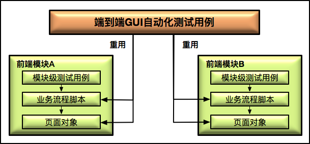

## GUI自动化测试

## 建立一个自动化测试用例

1. 下载Chrome Driver并放入环境变量
2. 建立一个空的Maven项目，然后在POM文件中加入Selunium2.0的依赖

3. Java创建main方法

```js
//	创建Chrome driver的实例
WebDriver driver = new ChromeDriver();

//	打开百度首页"www.baidu.com"
driver.navigate().to("http://www.baidu.com");

//	通过name属性找到搜索输入框
WebElement search_input = driver.findElement(By.name("wd"))

//	在搜索输入框中输入搜索关键字"极客时间"
search_input.sendkeys("极客时间")

//	递交搜索请求
search_input.submit();

//	等待固定时间3秒
Thread.sleep(3000);

//	验证搜索结果页面的标题
Assert.assertEquials("极客时间_百度搜索",driver.getTitle())

//	关闭浏览器窗口
driver.quit();

```

### selenium实现原理

seleniumV1.0 的核心是 Selenium RC，而 V2.0 的核心是 WebDriver.Selenium 3.0 也已经发布一段时间了，V3.0 相比 V2.0 并没有本质上的变化，主要是增加了对 MacOS 的 Safari 和 Windows 的 Edge 的支持，并彻底删除了对 Selenium RC 的支持。

#### Selenium2.0的工作原理

> 使用浏览器原生的 WebDriver 实现页面操作。


1. 当使用 Selenium2.0 启动浏览器 Web Browser 时，后台会同时启动基于 WebDriver Wire 协议的 Web Service 作为 Selenium 的 Remote Server，并将其与浏览器绑定。绑定完成后，Remote Server 就开始监听 Client 端的操作请求。

2. 执行测试时，测试用例会作为 Client 端，将需要执行的页面操作请求以 Http Request 的方式发送给 Remote Server。该 HTTP Request 的 body，是以 WebDriver Wire 协议规定的 JSON 格式来描述需要浏览器执行的具体操作。

3. Remote Server 接收到请求后，会对请求进行解析，并将解析结果发给 WebDriver，由 WebDriver 实际执行浏览器的操作。

4. WebDriver 可以看做是直接操作浏览器的原生组件（Native Component），所以搭建测试环境时，通常都需要先下载浏览器对应的 WebDriver。

   相当于增加了一个浏览器监听器或者中介者，将测试用例与浏览器连接起来。


### GUI自动化测试框架

- Selenium
- UFT（以前的 QTP）：以数据库中的表作为数据驱动数据源
- RFT
- Nightwatch
- pytest+selenium+allure+jenkins
- non-selenium
- uiautomator1/2
- appium

### 测试脚本和数据的解耦

如果在测试脚本中硬编码（hardcode）测试数据的话，测试脚本灵活性会非常低。而且，对于那些具有相同页面操作，而只是测试输入数据不同的用例来说，就会存在大量重复的代码。

数据驱动测试（Data-driven）:测试输入数据单独放在一个文件中,通常是表格的形式，常见的CSV、json文件、yaml文件、数据库，通data provider去CSV文件中读取一行数据，赋值给相应的变量，然后执行测试用例。

### 页面对象模型

> 页面对象模型的核心理念是，以页面（Web Page 或者 Native App Page）为单位来封装页面上的控件以及控件的部分操作。而测试用例，更确切地说是操作函数，基于页面封装对象来完成具体的界面操作，最典型的模式是“XXXPage.YYYComponent.ZZZOperation”。而有些观点则认为，页面对象模型只封装控件，而操作应该再做一层额外的封装。

DOM模型?BOM模型?

1. 模块化思想：把一些通用的操作集合打包成一个个名字有意义的函数，然后 GUI 自动化脚本直接去调用这些操作函数来构成整个测试用例，这样 GUI 自动化测试脚本就从原本的“流水账”过渡到了“可重用脚本片段”。

> 以下为伪代码

```js
//	调用模块
testcase__001(){
    login("testuser001","password");
    search("bookname");
    logout()
}


//	执行模块:可读性差、难以维护
login(username,password){
    findElementByName("username").input(username);
    findElementByName("password").input(password);
    findElementByName("login_ok_button").click();
    wait(3000)
}

search(bookname){
    findElementByName("book_homepage").click();
    wait(3000);
    findElementByName("bookname_search_title_field").input(bookname);
    fintElementByName("search_button").click();
    wait(3000);
    assert(...);
}

logout(){
    findElementByName("logout_button").click();
    fintElementByName("logout_ok_button").click();
}


//	按照页面对象模型构建执行脚本
class loginPage{
    username_input = findElementByName("username");
	password_input = findElementByName("password");
	login_ok_button = findElementByName("login_ok_button");
	login_cancel_button = findElementByName("login_cancel_button");
}

login(username,password){
    loginPage.username_input.input(username);
    loginPage.password_input.input(password);
    loginPage.login_ok_button.click();
}
```

接口测试的含义范围一般更广，api测试是接口测试的一种，接口测试还包括传统软件集成测试中的模块之间的接口。数据放在单独地文件中，元素定位放在yaml文件中，实现数据和代码分离，不管数据还是页面ui变化，直接修改数据文件和yaml文件就可以了，节省维护成本，另外，我们会对共用功能进行封装，对不同页面进行封装，减少重复代码的使用，提高代码的质量，测试用例直接调用就可以了。更倾向于页面封装于控件，而操作在做一次封装，这样页面和操作完全分开，不同的对象去操作，更透明！通过web url,自动生成页面上所有控件的定位信息。一套测试脚本可以抽象出三个类。
测试用例类：定义一个测试用例；
操作函数类：放测试用例调用的操作函数；
页面类（page object）：放置被封装的页面控件；

### 业务流程(business flow)

> 业务流程抽象是，基于操作函数的更接近于实际业务的更高层次的抽象方式。

比如某个具体的业务流程是:已注册的用户登录平台购买指定的书籍。那么，基于业务流程抽象的测试用例伪代码为:

```java
//	业务流-登录
LoginFlowParameters loginFlowParameters = new LoginFlowParameters();
loginFlowParameters.setUserName('username");
loginFlowParameters.setPassword('password");
LoginFlow loginFlow = new LoginFlow(loginFlowParameters);
loginFlow.execute();
//	业务流-搜索书籍
SearchBookFlowParameters searchBookFlowParameters = new SearchBookFlowParameters();
searchBookFlowParameters.setBookName("bookname");
SearchBookFlow searchBookFlow = new SearchBookFlowl(searchBookFlowParameters);
searchBookFlow.withStartPage(loginFlow.getEndPage()).execute();
//	业务流-购买书籍
CheckoutBookFlowParameters checkoutBookFlowParameters = new CheckoutBookFlowParameters();
checkoutBookFlowParameters.setBookID(searchBookFlow.getOutPut().getBookID());
CheckoutBookFlow checkoutBookFlow = new CheckoutBookFlow(checkoutBookFlowParameters);
checkoutBookFlow.withStartPage(searchBookFlow.getEndPage()).execute();                               
//	业务流-登出
LogoutFlow logoutFlow = new LogoutFlow();
logoutFlow.withStartPage(checkoutBookFlow.getEndPage()).execute();
```

对于每一个业务流程类，都会有相应的业务流程输入参数类与之一一对应。具体的步骤通常有这么几步：

1. 初始化一个业务流程输入参数类的实例；
2. 给这个实例赋值；
3. 用这个输入参数实例来初始化业务流程类的实例；
4. 执行这个业务流程实例。

#### 业务流程的方法

1. 业务流程（Business Flow）的封装更接近实际业务；
2. 基于业务流程的测试用例非常标准化，遵循“参数准备”、“实例化 Flow”和“执行 Flow”这三个大步骤，非常适用于测试代码的自动生成；
3. 由于更接近实际业务，所以可以很方便地和 BDD 结合。BDD 就是 Behavior Driven Development，即行为驱动开发

业务流程抽象是，基于操作函数的更接近于实际业务的更高层次的抽象方式。基于业务流程抽象实现的测试用例往往具有较好的灵活性，可以根据实际测试需求方便地组装出各种测试用例。

业务流程的核心思想是，从业务的维度来指导测试业务流程的封装。由于业务流程封装通常很贴近实际业务，所以特别适用于组装面向终端用户的端到端（E2E）的系统功能测试用例，尤其适用于业务功能非常多，并且存在各种组合的 E2E 测试场景。

#### 如何把控操作函数的粒度？

> 一个操作函数到底应该包含多少操作步骤才是最合适的。

### 组织测试用例脚本

> 重用已有的页面对象以及业务流程（business flow）

GUI自动化脚本涉及到了三次封装
1.引入页面对象进行第一次封装
2.引入操作函数进行第二次封装
3.引入业务流程进行第三次封装

### GUI测试数据

分类：

1. 测试输入数据
2. 准备数据

创建测试数据的方法主要分为三种：

1. API 调用；
2. 数据库操作；
3. 综合运用 API 调用和数据库操作。

从创建的时机来讲，创建测试数据的方法主要分为两种：

1. 测试用例执行过程中，实时创建测试数据，我们通常称这种方式为 On-the-fly。
2. 测试用例执行前，事先创建好“开箱即用”的测试数据，我们通常称这种方式为 Out-of-box。

在实际项目中，对于创建数据的技术手段而言，最佳的选择是利用 API 来创建数据，只有当 API 不能满足数据创建的需求时，才会使用数据库操作的手段。

对于相对稳定的测试数据，比如商品类型、图书类型等，往往采用 Out-of-box 的方式以提高效率；而对于那些只能一次性使用的测试数据，比如商品、订单、优惠券等，往往采用 On-the-fly 的方式以保证不存在脏数据问题。

### 基于api调用创建测试数据

由于 API 通常都有安全相关的 token 机制来保护，所以实际项目中，通常会把对这些 API 的调用以代码的形式封装为测试数据工具（Test Data Utility）。

这种方式最大的好处就是，测试数据的准确性直接由产品 API 保证，缺点是并不是所有的测试数据都有相关的 API 来支持。另外，对需要大量创建数据的测试来说，基于 API 调用方式的执行效率，即使采用了并发机制也不会十分理想。为了解决执行效率的问题，就有了基于数据库操作的测试数据创建手段。

### 基于数据库操作创建测试数据

我们可以把创建和修改数据的相关 SQL 语句封装成测试数据工具，以方便测试用例的使用。但是，如果你正尝试在实际项目中运用这个方法，不可避免地会遇到如何才能找到正确的 SQL 语句来创建和修改数据的问题。因为，创建或修改一条测试数据往往会涉及很多业务表，任何的遗漏都会造成测试数据的不准确，从而导致有些测试因为数据问题而无法进行。

那么，现在我就提供两个思路来帮你解决这个问题：

1. 手工方式。查阅设计文档和产品代码，找到相关的 SQL 语句集合。或者，直接找开发人员索要相关的 SQL 语句集合。
2. 自动方式。在测试环境中，先在只有一个活跃用户的情况下，通过 GUI 界面操作完成数据的创建、修改，然后利用数据库监控工具获取这段时间内所有的业务表修改记录，以此为依据开发 SQL 语句集。

### 综合运用 API 调用和数据库操作创建测试数据

我们的产品有一个best practice的包，里面包含了很多数据，对测试非常有用

### 页面对象自动生成

> 页面对象自动生成技术，属于典型的“自动化你的自动化”的应用场景。它的基本思路是，你不用再手工维护 Page Class 了，只需要提供 Web 的 URL，它就会自动帮你生成这个页面上所有控件的定位信息，并自动生成 Page Class。

面对象模型，是以 Web 页面为单位来封装页面上的控件以及控件的部分操作，而测试用例基于页面对象完成具体操作。最典型的模式就是：XXXPage.YYYComponent.ZZZOperation。

工具:

- UTF 支持页面对象自动生成功能、对Page Class进行版本管理
- 开源的自动化方案，页面对象自动生成功能一般需要自己开发，并且需要与你所用的自动化测试框架深度绑定。目前，中小企业很少有自己去实现这一功能的。
-  Katalon Studio 收费

### GUI测试数据自动生成

1. 根据 GUI 输入数据类型，以及对应的自定义规则库自动生成测试输入数据。

   GUI 界面上有一个“书名”输入框，它的数据类型是 string。那么，基于数据类型就可以自动生成诸如 Null、SQL 注入、超长字符串、非英语字符等测试数据。同时，根据自定义规则库，还可以根据具体规则生成各种测试数据。这个自定义规则库里面的规则，往往反映了具体的业务逻辑。比如，对于“书名”，就会有书名不能大于多少个字符、一些典型的书名（比如，英文书名、中文书名等）等等业务方面的要求，那么就可以根据这些业务要求来生成测试数据。根据自定义规则生成测试数据的核心思想，与安全扫描软件 AppScan 基于攻击规则库自动生成和执行安全测试的方式，有异曲同工之处。

2. 对于需要组合多个测试输入数据的场景，测试数据自动生成可以自动完成多个测试数据的笛卡尔积组合，然后再以人工的方式剔除掉非法的数据组合。

   更常见的用法是，先手动选择部分输入数据进行笛卡尔积，并删除不合法的部分；然后，在此基础上，再人为添加更多业务上有意义的输入数据组合。比如，输入数据有 A、B、C、D、E、F 六个参数，你可以先选取最典型的几个参数生成笛卡尔积，假设这里选取 A、B 和 C；然后，在生成的笛卡尔积中删除业务上不合法的组合；最后，再结合 D、E 和 F 的一些典型取值，构成更多的测试输入数据组合。

### 无头浏览器

> 无头浏览器，其实是一个特殊的浏览器，你可以把它简单地想象成是运行在内存中的浏览器。它拥有完整的浏览器内核，包括 JavaScript 解析引擎、渲染引擎等。与普通浏览器最大的不同是，无头浏览器执行过程中看不到运行的界面，但是你依然可以用 GUI 测试框架的截图功能截取它执行中的页面。无头浏览器的主要应用场景，包括 GUI 自动化测试、页面监控以及网络爬虫这三种。

1. 测试执行速度更快。 相对于普通浏览器来说，无头浏览器无需加载 CSS 以及渲染页面，在测试用例的执行速度上有很大的优势。
2. 减少对测试执行的干扰。 可以减少操作系统以及其他软件（比如杀毒软件等）不可预期的弹出框，对浏览器测试的干扰。
3. 简化测试执行环境的搭建。 对于大量测试用例的执行而言，可以减少对大规模 Selenium Grid 集群的依赖，GUI 测试可以直接运行在无界面的服务器上。
4. 在单机环境实现测试的并发执行。 可以在单机上很方便地运行多个无头浏览器，实现测试用例的并发执行。

无头浏览器并不完美，它最大的缺点是，不能完全模拟真实的用户行为，而且由于没有实际完成页面的渲染，所以不太适用于需要对于页面布局进行验证的场景。同时，业界也一直缺乏理想的无头浏览器方案。

- Headless Chrome+Puppeteer
- PhantomJS 停止维护,bug超多
- selenium + xpath

个人感觉目前测试中，场景测试重要性是最高的，但是自动生成可能解决不了场景覆盖的问题，不过如果借鉴最新的机器学习算法，说不定有新发现；

自动测试数据生成的应用场景主要是覆盖边界值和典型易出错场景，应用价值还是比较大的。关于无头浏览器，目前的应用领域主要在爬虫和devops中的环境健康检查，就是去看一下网站基本的页面是否可以打开，最最基本的smoke用例是否可以通过，如果不行，那就会把环境健康状态标红，并从可用列表中移除

如果是静态页面，那就好解析和分类页面元素的源代码，如果页面是react页面，那就要要基于react来做解析，不同前端框架的页面解析还都不同，有很多细节要处理。

### GUI测试稳定性

GUI 自动化测试稳定性，最典型的表现形式就是，同样的测试用例在同样的环境上，时而测试通过，时而测试失败。 

提高 GUI 测试稳定性，首先你需要知道到底是什么原因引起的不稳定。你必须找出尽可能多的不稳定因素，然后找到每一类不稳定因素对应的解决方案。

五种造成 GUI 测试不稳定的因素：

- 非预计的弹出对话框：杀毒软件、病毒警告、系统更新、用户调查
- 页面控件属性的细微变化；优先采用xpath,
- 被测系统的 A/B 测试:A/B 测试，是互联网产品常用的一种测试方法。它为 Web 或 App 的界面或流程提供两个不同的版本，然后让用户随机访问其中一个版本，并收集两个版本的用户体验数据和业务数据，最后分析评估出最好的版本用于正式发布。
- 随机的页面延迟造成控件识别失败:重试、设计最大超时时间
- 测试数据问题。

##  GUI自动化测试报告

1. 截图+录屏(gif,尽量减少体积)
2. 测试用例
3. 服务器日志

#### 其他

1. UTF框架自动截图
2. Selenium: 通过操作函数以及HOOK函数实现
3. 微软的psr.exe步骤截图器--> 全是截图,也是6!
4. ScreenToGif工具截图

### 设计GUI自动化测试策略

> 自动化测试用例的原则，通常是：优先选取业务关键路径以及 Happy Path 作为自动化测试的范围。在资源充裕的情况下，我们希望这个阶段的自动化率可以达到 70%-80%。 所以，前端模块的质量保证主要依赖这部分测试。

#### 设计测试策略

1. 轻量级GUI测试

2. 以前端组件为最小颗粒进行全面测试 --> Jest单元测试

3. 构建页面对象库 --> 在页面对象中封装业务流程

4. 一部分是，通过探索式测试的方法手工执行测试，目标是尽可能多地发现新问题；另一部分是，通过 GUI 自动化测试执行基本业务功能的回归测试，保证网站核心业务相关的所有功能的正确性。

   Unit > Integration > E2E 的理论模型



#### 组件测试用例脚本

## 移动应用测试

- Web App:有 GUI 自动化测试的方法和技术，比如数据驱动、页面对象模型、业务流程封装等，都适用于 Web App 的测试。
- Native App:iOS 一般采用 XCUITest Driver，而 Android 一般采用 UiAutomator2 或者 Espresso 等，但是数据驱动、页面对象以及业务流程封装的思想依旧适用。
- Hybrid App:Native Container 的测试，可能需要用到 XCUITest 或者 UiAutomator2 这样的原生测试框架，而对 Container 中 HTML5 的测试，基本和传统的网页测试没什么区别，所以原本基于 GUI 的测试思想和方法都能继续适用。

### 移动应用专项测试的思路和方法

想不到的问题

- 流量使用过多；
- 耗电量过大；
- 在某些设备终端上出现崩溃或者闪退的现象；
- 多个移动应用相互切换后，行为异常；
- 在某些设备终端上无法顺利安装或卸载；
- 弱网络环境下，无法正常使用；
- Android 环境下，经常出现 ANR(Application Not Responding)；

1. 交叉事件测试

   > 交叉事件测试也叫中断测试，是指 App 执行过程中，有其他事件或者应用中断当前应用执行的测试。比如，App 在前台运行过程中，突然有电话打进来，或者收到短信，再或者是系统闹钟等等情况。所以，在 App 测试时，就需要把这些常见的中断情况考虑在内，并进行相关的测试。

   手工测试，真机进行

   交叉事件测试，需要覆盖的场景主要包括：

   - 多个 App 同时在后台运行，并交替切换至前台是否影响正常功能；
   - 要求相同系统资源的多个 App 前后台交替切换是否影响正常功能，比如两个 App 都需要播放音乐，那么两者在交替切换的过程中，播放音乐功能是否正常；
   - App 运行时接听电话；
   - App 运行时接收信息；
   - App 运行时提示系统升级；
   - App 运行时发生系统闹钟事件；
   - App 运行时进入低电量模式；
   - App 运行时第三方安全软件弹出告警；
   - App 运行时发生网络切换，比如，由 Wifi 切换到移动 4G 网络，或者从 4G 网络切换到 3G 网络等；

2. 兼容性测试

   > 要确保 App 在各种终端设备、各种操作系统版本、各种屏幕分辨率、各种网络环境下，功能的正确性。常见的 App 兼容性测试往往需要覆盖以下的测试场景：

   常见的 App 兼容性测试往往需要覆盖以下的测试场景：

   - 不同操作系统的兼容性，包括主流的 Andoird 和 iOS 版本；
   - 主流的设备分辨率下的兼容性；
   - 主流移动终端机型的兼容性；
   - 同一操作系统中，不同语言设置时的兼容性；
   - 不同网络连接下的兼容性，比如 Wifi、GPRS、EDGE、CDMA200 等；
   - 在单一设备上，与主流热门 App 的兼容性，比如微信、抖音、淘宝等；…

   兼容性测试，通常都需要在各种真机上执行相同或者类似的测试用例，所以往往采用自动化测试的手段。 同时，由于需要覆盖大量的真实设备，除了大公司会基于 Appium + Selenium Grid + OpenSTF 去搭建自己的移动设备私有云平台外，其他公司一般都会使用第三方的移动设备云测平台完成兼容性测试。第三方的移动设备云测平台，国外最知名的是 SauceLab，国内主流的是 Testin

3. 流量测试

   > 由于 App 经常需要在移动互联网环境下运行，而移动互联网通常按照实际使用流量计费，所以如果你的 App 耗费的流量过多，那么一定不会很受欢迎。流量测试，往往借助于 Android 和 iOS 自带的工具进行流量统计，也可以利用 tcpdump、Wireshark 和 Fiddler 等网络分析工具。

   流量测试，通常包含以下几个方面的内容：

   - App 执行业务操作引起的流量；
   - App 在后台运行时的消耗流量；
   - App 安装完成后首次启动耗费的流量；
   - App 安装包本身的大小；
   - App 内购买或者升级需要的流量。

   减少 App 消耗的流量的方法：

   - 启用数据压缩，尤其是图片；
   - 使用优化的数据格式，比如同样信息量的 JSON 文件就要比 XML 文件小；
   - 遇到既需要加密又需要压缩的场景，一定是先压缩再加密；
   - 减少单次 GUI 操作触发的后台调用数量；
   - 每次回传数据尽可能只包括必要的数据；
   - 启用客户端的缓存机制；

4. 耗电量测试

   耗电量测试通常从三个方面来考量：

   - App 运行但没有执行业务操作时的耗电量；
   - App 运行且密集执行业务操作时的耗电量；
   - App 后台运行的耗电量。

   

   - Android 通过 adb 命令“adb shell dumpsys battery”来获取应用的耗电量信息；

   - iOS 通过 Apple 的官方工具 Sysdiagnose 来收集耗电量信息，然后，可以进一步通过 Instrument 工具链中的 Energy Diagnostics 进行耗电量分析。

5. 弱网络测试

   > 与传统桌面应用不同，移动应用的网络环境比较多样，而且经常出现需要在不同网络之间切换的场景，即使是在同一网络环境下，也会出现网络连接状态时好时坏的情况，比如时高时低的延迟、经常丢包、频繁断线，在乘坐地铁、穿越隧道，和地下车库的场景下经常会发生。

   在测试阶段，模拟这些网络环境，在 App 发布前尽可能多地发现并修复问题。

   Facebook 的 Augmented Traffic Control（ATC）。

6. 边界测试

   > 边界测试是指，移动 App 在一些临界状态下的行为功能的验证测试，基本思路是需要找出各种潜在的临界场景，并对每一类临界场景做验证和测试。 

   主要的场景有：

   - 系统内存占用大于 90% 的场景；
   - 系统存储占用大于 95% 的场景；
   - 飞行模式来回切换的场景；
   - App 不具有某些系统访问权限的场景，比如 App 由于隐私设置不能访问相册或者通讯录等；
   - 长时间使用 App，系统资源是否有异常，比如内存泄漏、过多的链接数等；
   - 出现 ANR 的场景；
   - 操作系统时间早于或者晚于标准时间的场景；
   - 时区切换的场景；…

   ## Appium框架

   


