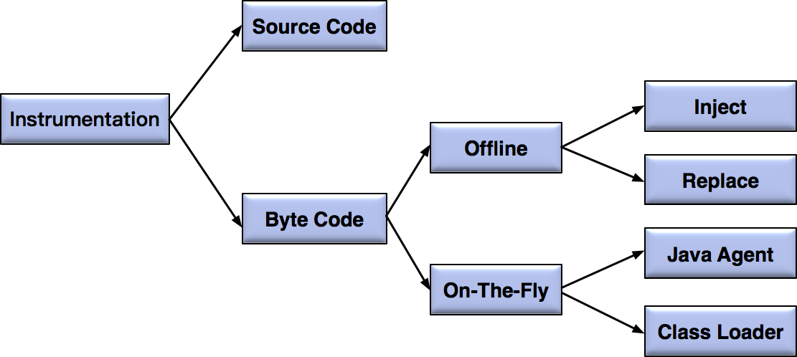
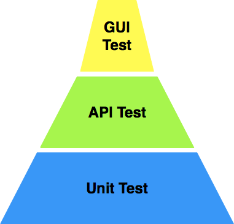
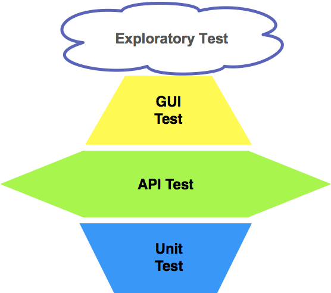

# 测试基础

## 从测试用例说起

### 等价类划分方法

将所有可能的输入数据划分成若干个子集，在每个子集中，如果任意一个输入数据对于揭露程序中潜在错误都具有同等效果，那么这样的子集就构成了一个等价类。后续只要从每个等价类中任意选取一个值进行测试，就可以用少量具有代表性的测试输入取得较好的测试覆盖结果。

### 边界值分析方法

选取输入、输出的边界值进行测试。因为通常大量的软件错误是发生在输入或输出范围的边界上，所以需要对边界值进行重点测试，通常选取正好等于、刚刚大于或刚刚小于边界的值作为测试数据。

边界值是等价类划分的补充

### 显式功能性需求

软件本身需要实现的具体功能

### 非显式功能性需求

从软件测试的维度来看，非功能性需求主要涉及安全性、性能以及兼容性三大方面。

### 穷尽测试

软件输入值和前提条件所有可能组合的测试方法，完成穷尽测试的系统里应该不残留任何未知的软件缺陷。

### 结语

绝大多数的软件工程实践中，测试由于受限于时间成本和经济成本，是不可能去穷尽所有可能的组合的，而是采用基于风险驱动的模式，有所侧重地选择测试范围和设计测试用例，以寻求缺陷风险和研发成本之间的平衡。

举例：

等价类分析法

用户登录

- 不输入用户名和密码
- 输入用户名和密码
  - 输入注册的用户名和密码
    - 输入正确的密码
  - 输入未注册的用户名和密码
- 输入用户名和密码其一
  - 不输入用户名
  - 不输入密码

边界值分析法

- 输入超过要求长度的用户名和密码
- 输入超出字符类型的用户名和密码

安全性测试

- 密码是否加密
- 密码是否具有有效期
- 不输入密码的情况下，直接输入url地址，是否允许跳转
- 密码是否可在页面源码下查看
- 输入典型的sql注入攻击字符
- 输入典型xss攻击
- 连续失败登录
- 同一终端的多种浏览器

性能测试

- 单用户登录的响应时间是否小于 3 秒；
- 单用户登录时，后台请求数量是否过多；
- 高并发场景下用户登录的响应时间是否小于 5 秒；
- 高并发场景下服务端的监控指标是否符合预期；
- 高集合点并发场景下，是否存在资源死锁和不合理的资源等待；
- 长时间大量用户连续登录和登出，服务器端是否存在内存泄漏。

兼容性测试

- 不同浏览器下，验证登录页面的显示以及功能正确性；
- 相同浏览器的不同版本下，验证登录页面的显示以及功能正确性；
- 不同移动设备终端的不同浏览器下，验证登录页面的显示以及功能正确性；
- 不同分辨率的界面下，验证登录页面的显示以及功能正确性。

## 如何设计测试用例

### 好的用例特征

1. 整体完备性： “好的”测试用例一定是一个完备的整体，是有效测试用例组成的集合，能够完全覆盖测试需求。等价类划分的
2. 准确性： 指的是对于每个等价类都能保证只要其中一个输入测试通过，其他输入也一定测试通过。
3. 等价类集合的完备性： 需要保证所有可能的边界值和边界条件都已经正确识别。

### 常用测试用例设计方法

1. 等价类划分方法

   只要从每个等价类中任意选取一个值进行测试，就可以用少量具有代表性的测试输入取得较好的测试覆盖结果。价类划分方法的另一个关键点是要找出所有“无效等价类”。

2. 边界值分析方法

   边界值分析是对等价类划分的补充，你从工程实践经验中可以发现，大量的错误发生在输入输出的边界值上，所以需要对边界值进行重点测试，通常选取正好等于、刚刚大于或刚刚小于边界的值作为测试数据。

3. 错误推测方法

   错误推测方法是指基于对被测试软件系统设计的理解、过往经验以及个人直觉，推测出软件可能存在的缺陷，从而有针对性地设计测试用例的方法。这个方法强调的是对被测试软件的需求理解以及设计实现的细节把握，当然还有个人的能力。

   缺点：难以系统化，而且过度依赖个人能力。为了降低对个人能力的依赖，通常会建立常见缺陷知识库作为检查点列表，去优化补充测试用例的设计。以该缺陷知识库作为数据驱动测试的输入来自动生成部分的测试数据。

### 如何设计

#### 测试用例的N种类型

- 软件开发过程中- 单元测试

- 软件模块集成时- 集成测试

- 打包部署后-面向终端用户的GUI测试

- 服务端API测试

- 中间件测试

#### 设计

1. 理解原始业务需求，每一个业务需求对应的软件功能需求点，由需求点分析出测试需求点，根据测试需求点设计测试用例

   

  

2. 理解被测试软件的架构

   比如数据库连接方式、数据库的读写分离、消息中间件 Kafka 的配置、缓存系统的层级分布、第三方系统的集成等等。

3. 理解被测软件的设计与实现细节，深入理解软件内部的处理逻辑

4. 需要引入需求覆盖率和代码覆盖率来衡量测试执行的完备性，并以此为依据来找出遗漏的测试点。 

## 单元测试

如果把电视机的生产、测试和软件的开发、测试进行类比，你可以发现：

- 电子元器件就像是软件中的单元，通常是函数或者类，对单个元器件的测试就像是软件测试中的单元测试；
- 组装完成的功能电路板就像是软件中的模块，对电路板的测试就像是软件中的集成测试
- 电视机全部组装完成就像是软件完成了预发布版本，电视机全部组装完成后的开机测试就像是软件中的系统测试。

### 定义

单元测试是指，对软件中的最小可测试单元在与程序其他部分相隔离的情况下进行检查和验证的工作，这里的最小可测试单元通常是指函数或者类。

### 说明

单元测试通常由开发工程师完成，一般会伴随开发代码一起递交至代码库。单元测试属于最严格的软件测试手段，是最接近代码底层实现的验证手段，可以在软件开发的早期以最小的成本保证局部代码的质量。

另外，单元测试都是以自动化的方式执行，所以在大量回归测试的场景下更能带来高收益。

### 设计

第一，代码的基本特征与产生错误的原因

要做到代码功能逻辑正确，必须做到分类正确并且完备无遗漏，同时每个分类的处理逻辑必须正确。

在具体的工程实践中，开发工程师为了设计并实现逻辑功能正确的代码，通常会有如下的考虑过程：

- 如果要实现正确的功能逻辑，会有哪几种正常的输入；
- 是否有需要特殊处理的多种边界输入；
- 各种潜在非法输入的可能性以及如何处理。

第二，单元测试用例详解

单元测试的用例是一个“输入数据”和“预计输出”的集合。 

用一句话概括就是“在明确了代码需要实现的逻辑功能的基础上，什么输入，应该产生什么输出”。

整的单元测试“输入数据”：

- 被测试函数的输入参数；
- 被测试函数内部需要读取的全局静态变量；
- 被测试函数内部需要读取的成员变量；
- 函数内部调用子函数获得的数据；
- 函数内部调用子函数改写的数据；
- 嵌入式系统中，在中断调用时改写的数据；

如果没有明确的预计输出，那么测试本身就失去了意义。同样地，“预计输出” 绝对不是只有函数返回值这么简单，还应该包括函数执行完成后所改写的所有数据。 

具体来看有以下几大类：

- 被测试函数的返回值；
- 被测试函数的输出参数；
- 被测试函数所改写的成员变量；
- 被测试函数所改写的全局变量；
- 被测试函数中进行的文件更新；
- 被测试函数中进行的数据库更新；
- 被测试函数中进行的消息队列更新；…

另外，对于预计输出值，你必须严格根据代码的功能逻辑来设定，而不能通过阅读代码来推算预期输出，否则就是“掩耳盗铃”了。

第三，驱动代码，桩代码和 Mock 代码

- 驱动代码是用来调用被测函数的，而桩代码和 Mock 代码是用来代替被测函数调用的真实代码的。

  - 驱动代码（Driver）指调用被测函数的代码，在单元测试过程中，驱动模块通常包括调用被测函数前的数据准备、调用被测函数以及验证相关结果三个步骤。驱动代码的结构，通常由单元测试的框架决定。

- 桩代码（Stub）是用来代替真实代码的临时代码。 比如，某个函数 A 的内部实现中调用了一个尚未实现的函数 B，为了对函数 A 的逻辑进行测试，那么就需要模拟一个函数 B，这个模拟的函数 B 的实现就是所谓的桩代码。（目的：保证单元测试之间的依赖问题，使用临时函数替代真实函数）

  - 桩代码的应用首先起到了隔离和补齐的作用，使被测代码能够独立编译、链接，并独立运行。同时，桩代码还具有控制被测函数执行路径的作用。

  Mock 代码和桩代码的本质区别是：测试期待结果的验证（Assert and Expectiation）。

- 对于 Mock 代码来说，我们的关注点是 Mock 方法有没有被调用，以什么样的参数被调用，被调用的次数，以及多个 Mock 函数的先后调用顺序。所以，在使用 Mock 代码的测试中，对于结果的验证（也就是 assert），通常出现在 Mock 函数中。
- 对于桩代码来说，我们的关注点是利用 Stub 来控制被测函数的执行路径，不会去关注 Stub 是否被调用以及怎么样被调用。所以，你在使用 Stub 的测试中，对于结果的验证（也就是 assert），通常出现在驱动代码中。

### 如何展开单元测试

1. 并不是所有的代码都要进行单元测试，通常只有底层模块或者核心模块的测试中才会采用单元测试。
2. 你需要确定单元测试框架的选型，这和开发语言直接相关。比如，Java 最常用的单元测试框架是 Junit 和 TestNG；C/C++ 最常用的单元测试框架是 CppTest 和 Parasoft C/C++test；框架选型完成后，你还需要对桩代码框架和 Mock 代码框架选型，选型的主要依据是开发所采用的具体技术栈。通常，单元测试框架、桩代码 /Mock 代码的选型工作由开发架构师和测试架构师共同决定。
3. 为了能够衡量单元测试的代码覆盖率，通常你还需要引入计算代码覆盖率的工具。不同的语言会有不同的代码覆盖率统计工具，比如 Java 的 JaCoCo，JavaScript 的 Istanbul。在后续的文章中，我还会详细为你介绍代码覆盖率的内容。
4. 最后你需要把单元测试执行、代码覆盖率统计和持续集成流水线做集成，以确保每次代码递交，都会自动触发单元测试，并在单元测试执行过程中自动统计代码覆盖率，最后以“单元测试通过率”和“代码覆盖率”为标准来决定本次代码递交是否能够被接受。

## 自动化测试的展开

### 什么是自动化测试

自动化测试是，把人对软件的测试行为转化为由机器执行测试行为的一种实践，对于最常见的 GUI 自动化测试来讲，就是由自动化测试工具模拟之前需要人工在软件界面上的各种操作，并且自动验证其结果是否符合预期。

自动化测试的本质是先写一段代码，然后去测试另一段代码，所以实现自动化测试用例本身属于开发工作，需要投入大量的时间和精力，并且已经开发完成的用例还必须随着被测对象的改变而不断更新，你还需要为此付出维护测试用例的成本。

当你发现自动化测试用例的维护成本高于其节省的测试成本时，自动化测试就失去了价值与意义，你也就需要在是否使用自动化测试上权衡取舍了。

### 进行自动化测试的原因

#### 原因

1. 自动化测试可以替代大量的手工机械重复性操作，测试工程师可以把更多的时间花在更全面的用例设计和新功能的测试上；
2. 自动化测试可以大幅提升回归测试的效率，非常适合敏捷开发过程；
3. 自动化测试可以更好地利用无人值守时间，去更频繁地执行测试，特别适合现在非工作时间执行测试，工作时间分析失败用例的工作模式；
4. 自动化测试可以高效实现某些手工测试无法完成或者代价巨大的测试类型，比如关键业务 7×24 小时持续运行的系统稳定性测试和高并发场景的压力测试等；
5. 自动化测试还可以保证每次测试执行的操作以及验证的一致性和可重复性，避免人为的遗漏或疏忽。

#### 自动化测试中的问题

1. 自动化测试并不能取代手工测试，它只能替代手工测试中执行频率高、机械化的重复步骤。你千万不要奢望所有的测试都自动化，否则一定会得不偿失。
2. 自动测试远比手动测试脆弱，无法应对被测系统的变化，业界一直有句玩笑话“开发手一抖，自动化测试忙一宿”，这也从侧面反映了自动化测试用例的维护成本一直居高不下的事实。其根本原因在于自动化测试本身不具有任何“智能”，只是按部就班地执行事先定义好的测试步骤并验证测试结果。对于执行过程中出现的明显错误和意外事件，自动化测试没有任何处理能力。
3. 自动化测试用例的开发工作量远大于单次的手工测试，所以只有当开发完成的测试用例的有效执行次数大于等于 5 次时，才能收回自动化测试的成本。
4. 手工测试发现的缺陷数量通常比自动化测试要更多，并且自动化测试仅仅能发现回归测试范围的缺陷。测试的效率很大程度上依赖自动化测试用例的设计以及实现质量，不稳定的自动化测试用例实现比没有自动化更糟糕。
5. 实行自动化测试的初期，用例开发效率通常都很低，大量初期开发的用例通常会在整个自动化测试体系成熟，和测试工程师全面掌握测试工具后，需要重构。
6. 业务测试专家和自动化测试专家通常是两批人，前者懂业务不懂自动化技术，后者懂自动化技术但不懂业务，只有二者紧密合作，才能高效开展自动化测试。
7. 自动化测试开发人员必须具备一定的编程能力，这对传统的手工测试工程师会是一个挑战。

### 什么样的项目适合做自动化测试

1. 需求稳定，不会频繁变更
2. 研发和维护周期长，需要频繁执行回归测试
3. 需要在多平台上重复运行相同测试的场景,比如GUI测试，在不同浏览器上运行，移动端测试，在不同手机版本上打开；
4. 测试项目无法通过手工测试实现，或者手工成本太高。比如并发测试、稳定性测试
5. 被测软件的开发比较规范，能够保证系统的可测试性。
6. 测试人员具备一定的编程能力。

### 其他

1. 产品比项目更适合自动化测试--> 有迭代周期，方便用例管理、优势体现、成本回收
2. 一次性项目，不适合执行自动化测试--> 成本过高,使用手工用例替代，或者人工直接测试
3. 中长期项目，对项目稳定的部分进行自动化，变动较大或者需求不明确的功能进行手工测试

## 软件开发各阶段有哪些自动化测试技术

- 单元测试的自动化技术

  - 用例框架代码生成的自动化；
  - 部分测试输入数据的自动化生成；
  - 自动桩代码的生成；
  - 被测代码的自动化静态分析；
  - 测试覆盖率的自动统计与分析。

- 代码级集成测试的自动化技术

  - 只不过代码级集成测试的关注点，更多的是软件模块之间的接口调用和数据传递。
  - 代码级集成测试与单元测试最大的区别只是，代码级集成测试中被测函数内部调用的其他函数必须是真实的，不允许使用桩代码代替，而单元测试中允许使用桩代码来模拟内部调用的其他函数。

- Web Service 测试的自动化技术

  > Web Service 测试，主要是指 SOAP API 和 REST API 这两类 API 测试，最典型的是采用 SoapUI 或 Postman 等类似的工具。但这类测试工具基本都是界面操作手动发起 Request 并验证 Response，所以难以和 CI/CD 集成，于是就出现了 API 自动化测试框架。

  - 对于基于代码的 API 测试用例，通常包含三大步骤：准备 API 调用时需要的测试数据；准备 API 的调用参数并发起 API 的调用；验证 API 调用的返回结果。

  - REST Assured框架

  - Web Service 测试“自动化”的内涵不仅仅包括 API 测试用例执行的自动化，还包括以下四个方面：
    - 测试脚手架代码的自动化生成：它生成的测试脚手架代码，通常包含了被测试 API 的调用、测试数据与脚本的分离，以及 Response 验证的空实现。
    - 部分测试输入数据的自动生成；
    - Response 验证的自动化：通常关注的点是返回状态码（status code）、Scheme 结构以及具体的字段值。Response 验证自动化的核心思想是自动比较两次相同 API 调用的返回结果，并自动识别出有差异的字段值，比较过程可以通过规则配置去掉诸如时间戳、会话 ID（Session ID）等动态值。
    - 基于 SoapUI 或者 Postman 的自动化脚本生成。
    - 开发一个自动化代码转换生成工具。这个工具的输入是 SoapUI 或者 Postman 的测试用例元数据（即测试用例的 JSON 元文件），输出是符合 API 测试框架规范的基于代码实现的测试用例。这样一来，原本的测试用例积累可以直接转换成在 CI/CD 上可以直接接入的自动化测试用例。

  - GUI 测试的自动化技术

    > 它的核心思想是，基于页面元素识别技术，对页面元素进行自动化操作，以模拟实际终端用户的行为并验证软件功能的正确性。

    目前，GUI 自动化测试主要分为两大方向，传统 Web 浏览器和移动端原生应用（Native App）的 GUI 自动化。虽然二者采用的具体技术差别很大，但是用例设计的思路类似。

    对于传统 Web 浏览器的 GUI 自动化测试，业内主流的开源方案采用 Selenium，商业方案采用 Micro Focus 的 UFT（前身是 HP 的 QTP）；

    对于移动端原生应用，通常采用主流的 Appium，它对 iOS 环境集成了 XCUITest，对 Android 环境集成了 UIAutomator 和 Espresso。

  于Spring-boot，Rest-Assured，Ccucumber开发了一个标准通用的微服务API自动化测试框架，我们项目里的所有微服务API都可以基于框架快速高效的在各个测试环境无缝切换进行自动化测试，并且完全集成到了公司的CICD Jenkins平台，以前从开发到单元测试，FVT测试，UAT测试，回归测试到MTP需要3天左右时间的Size的Story，现在相同工作量Size的Story只需不到一天时间就可以全部完成，期间除了产品代码开发和少部分特殊数据的准备，部分新增用例的开发外，全部都是在Jenkins上自动完成。

  - Katalon Studio
  - robot framework+requestslibrary
  - jmeter接口自动化
  -  appium+selenium
  - 我们利用python制作了一个api自动化测试平台，根据开发提供的swagger页面，自动抓取api接口，根据其中的参数类型，和设置的规则如输入参数的必须非必需，参数的等价类，边界值，参数间的依赖等自动生成用例。
    对于预期响应，我们根据生成的正确用例，连续三次请求的返回值，取不变的字段作为预期响应。
    对于需要依赖的接口，提供mock功能。
    对于用例执行结果，自动生成html页面和一个通过率的返回值，用于ci/cd。
    目前已在部门推广。没有真正理解自动化的概念，过去只是片面的认为用例执行的自动化就是自动化，也是为自动化而自动化。其实自动化贯穿了整个测试过程，从用例设计，数据准备，用例生成，响应判断，用例执行，执行结果分析，都包含了自动化的内容。现在devops的流行，让自动化的占据了更多的比重。个人认为自动化最重要的是思想，当现在宏观的角度看待项目，看待整个测试过程，自动化应该是我们工作的指导思想，就是通过一切手段高质量、高效率、低入驻成本的守护产品的质量。测试主要精力放在用例设计和业务的理解上，自动化的实现只是一种手段，不能过于追求自动化实现，反而忽略了测试用例的设计，这样不仅本末倒置，而且失去了自动化的意义。

  ## 测试覆盖率

  试覆盖率通常被用来衡量测试的充分性和完整性，从广义的角度来讲，测试覆盖率主要分为两大类，一类是面向项目的需求覆盖率，另一类是更偏向技术的代码覆盖率。

  ### 需求覆盖率

  需求覆盖率是指测试对需求的覆盖程度，通常的做法是将每一条分解后的软件需求和对应的测试建立一对多的映射关系，最终目标是保证测试可以覆盖每个需求，以保证软件产品的质量。

  我们通常采用 ALM，Doors 和 TestLink 等需求管理工具来建立需求和测试的对应关系，并以此计算测试覆盖率。

  所以，互联网测试项目中很少直接基于需求来衡量测试覆盖率，而是将软件需求转换成测试需求，然后基于测试需求再来设计测试点。

  ### 代码覆盖率

  

  代码覆盖率是指，至少被执行了一次的条目数占整个条目数的百分比。

  如果“条目数”是语句，对应的就是代码行覆盖率；如果“条目数”是函数，对应的就是函数覆盖率；如果“条目数”是路径，那么对应的就是路径覆盖率。依此类推，你就可以得到绝大多数常见的代码覆盖率类型的定义。

  最常用的三种代码覆盖率指标。

  - 行覆盖率又称为语句覆盖率，指已经被执行到的语句占总可执行语句（不包含类似 C++ 的头文件声明、代码注释、空行等等）的百分比。这是最常用也是要求最低的覆盖率指标。实际项目中通常会结合判定覆盖率或者条件覆盖率一起使用。
  - 判定覆盖又称分支覆盖，用以度量程序中每一个判定的分支是否都被测试到了，即代码中每个判断的取真分支和取假分支是否各被覆盖至少各一次。比如，对于 if(a>0 && b>0)，就要求覆盖“a>0 && b>0”为 TURE 和 FALSE 各一次。
  - 条件覆盖是指，判定中的每个条件的可能取值至少满足一次，度量判定中的每个条件的结果 TRUE 和 FALSE 是否都被测试到了。比如，对于 if(a>0 && b>0)，就要求“a>0”取 TRUE 和 FALSE 各一次，同时要求“b>0”取 TRUE 和 FALSE 各一次。

  统计代码覆盖率的根本目的是找出潜在的遗漏测试用例，并有针对性的进行补充，同时还可以识别出代码中那些由于需求变更等原因造成的不可达的废弃代码。

  总结来讲，高的代码覆盖率不一定能保证软件的质量，但是低的代码覆盖率一定不能能保证软件的质量。

  ### 代码覆盖率工具

  - JaCoCo
  - Jest

  ### 覆盖率工具的实现原理？？？

  > 实现代码覆盖率的统计，最基本的方法就是注入（Instrumentation）。简单地说，注入就是在被测代码中自动插入用于覆盖率统计的探针（Probe）代码，并保证插入的探针代码不会给原代码带来任何影响。

  

需求覆盖率其实就是用需求管理工具来映射需求和测试，更多的是管理，而不是技术

## 测试报告

缺陷报告是测试工程师与开发工程师交流沟通的重要桥梁，也是测试工程师日常工作的重要输出。 作为优秀的测试工程师，最基本的一项技能就是，把发现的缺陷准确无歧义地表达清楚。

软件企业通常都有缺陷管理系统，比如典型的 ALM（以前的 Quality Center）、JIRA、Bugzilla、BugFree 和 Mantis 等。当使用这类系统递交缺陷时，会自动生成模板，你只要按照其中的必填字段提供缺陷的详细信息就可以了。

你必须牢牢记住的是，好的缺陷报告绝对不是大量信息的堆叠，而是以高效的方式提供准确有用的信息。

- 缺陷标题

  > 缺陷标题通常是别人最先看到的部分，是对缺陷的概括性描述，通常采用“在什么情况下发生了什么问题”的模式。首先，对“什么问题”的描述不仅

- 缺陷概述

- 缺陷影响

- 环境配置

  > 需要注意的是，环境配置的内容通常是按需描述，也就是说通常只描述那些重现缺陷的环境敏感信息。

  - 操作系统的类型与版本
  - 被测软件版本
  - 浏览器的种类和版本
  - 被测软件的配置信息
  - 集群的配置参数
  - 中间件的版本信息
  - 

- 前置条件

  > 前置条件是指测试步骤开始前系统应该处在的状态，其目的是减少缺陷重现步骤的描述。合理地使用前置条件可以在描述缺陷重现步骤时排除不必要的干扰，使其更有针对性。

  比如，某个业务操作需要先完成用户登录，你在缺陷重现步骤里就没有必要描述登录操作的步骤细节，可以直接使用 “前置条件：用户已完成登录”的描述方式；再比如，用户在执行登录操作前，需要事先在被测系统准备好待登录用户，你在描述时也无需增加“用测试数据生成工具生成用户”的步骤，可以直接使用 “前置条件：用户已完成注册”的描述方式。

- 缺陷重现步骤

- 期望结果和实际结果

- 优先级和严重程序

- 变通方案(workaround)

  > 变通方案是提供一种临时绕开当前缺陷而不影响产品功能的方式，通常由测试工程师或者开发工程师完成，或者他们一同决定。

- 根原因分析(Root Caunse Analysis)

- 附件(Attachment)
  - 界面截图
  - 测试用例日志
  - 服务器端日志
  - GUI测试的执行视频

## 测试计划

> 迭代测试计划

- 测试范围:

  - 测试范围描述的是被测对象以及主要的测试内容。
  - 测试范围中需要明确“测什么”和“不测什么”。

- 测试策略

  - 需要明确“先测什么后测什么”和“如何来测”这两个问题。

  - 测试策略会要求我们明确测试的重点，以及各项测试的先后顺序。

  - 测试策略还需要说明，采用什么样的测试类型和测试方法。 这里需要注意的是，不仅要给出为什么要选用这个测试类型，还要详细说明具体的实施方法。第一，功能测试

    - 功能测试:

      - 根据需求分析的思维导图来设计测试用例
      - 主线业务：自动化测试--> 回归测试
      - 手工测试:用例设计方法、测试数据
      - 被测软件的可测试性

    - 兼容性测试

      - web测试：覆盖的浏览器和版本
      - 移动设备测试：需要覆盖的设备类型和IOS/Android版本
        - 已有产品，支持TOP30%的移动设备
        - 全新产品，通过TakingData这样的网站确定

    - 性能测试

      - 明确性能需求：并发用户数、响应时间、事务吞吐量

      - 设计性能测试场景

      - 确定性能测试框架

        要点

        - Api测试
        - 模拟用户在终端进行基于协议的压力测试
        - 基于模块进行压力测试还是全链路压测
        - api并发调用产生测试数据
        - 直接在数据库上insert和update操作
          1. 性能测试的实施，往往先要根据业务场景来决定需要开发哪些单用户脚本，脚本的开发会涉及到很多性能测试脚本特有的概念，比如思考时间、集合点、动态关联等等。
          2. 脚本开发完成后，你还要以脚本为单位组织测试场景（Scenario），场景定义简单来说就是百分之多少的用户在做登录、百分之多少的用户在做查询、每个用户的操作步骤之间需要等待多少时间、并发用户的增速是 5 秒一个，还是 5 秒 2 个等等。
          3. 最后，才是具体的测试场景执行。和自动化功能测试不同，性能测试执行完成后性能测试报告的解读，是整个测试过程中最关键的点。

      - 接口测试

      - 集成测试

      - 安全测试

      - 容量验证

      - 安装测试

      - 故障恢复测试等

- 测试进度

  - 开始时间
  - 所需工作量
  - 预计完成时间
  - 最终产品上线发布时间

- 测试风险评估

  - 需求变更:增删改需求重新分析测试需求，确定变更后的测试范围和资源评估，并与项目经理和产品经理及时沟通因此引起的测试进度变化。
  - 开发延期
  - 发现重大bug
  - 人员变动

- 测试资源

  - 测试人员
  - 测试环境
    - 使用哪个容器

## 测试工程师的核心竞争力

1. 测试策略设计能力（测试计划规划与安排）
   - 测试要具体执行到什么程度；
   - 测试需要借助于什么工具；
   - 如何运用自动化测试以及自动化测试框架，以及如何选型；
   - 测试人员资源如何合理分配；
   - 测试进度如何安排；
   - 测试风险如何应对。
2. 测试用例设计能力
   - 常见缺陷模式
   - 典型的错误类型
3. 快速学习能力
   - 学习业务
   - 学习技术
4. 探索性测试思维
5. 缺陷分析能力

- 对于已经发现的缺陷，结合发生错误的上下文以及后台日志，可以预测或者定位缺陷的发生原因，甚至可以明确指出具体出错的代码行，由此可以大幅缩短缺陷的修复周期，并提高开发工程师对于测试工程师的认可以及信任度；
- 根据已经发现的缺陷，结合探索性测试思维，推断同类缺陷存在的可能性，并由此找出所有相关的潜在缺陷；
- 可以对一段时间内所发生的缺陷类型和趋势进行合理分析，由点到面预估整体质量的健康状态，并能够对高频缺陷类型提供系统性的发现和预防措施，并以此来调整后续的测试策略。

6. 自动化测试技术
7. 沟通能力
8. 测试需求分析
9. 知识面

## 非测试知识的掌握

1. 网络架构的核心知识

2. 容器技术

   1. 软件为Docer Image
   2. 在容器中测试
   3. 打包测试用例和执行框架为Doker Image
   4. 版本管理机制

3. 云计算

   - 云端部署技术细节
   - 基础设施及服务：测试执行环境服务、测试数据准备服务

4. DevOps思维

   > DevOps 强调的是，开发、测试和运维等组织团队之间，通过高效自动化工具的协作和沟通，来完成软件的全生命周期管理，从而实现更频繁地持续交付高质量的软件，其根本目的是要提升业务的交付能力。DevOps 的具体表现形式可以是工具、方法和流水线，但其更深层次的内涵还是在思想方法，以敏捷和精益为核心，通过发现问题，以系统性的方法或者工具来解决问题，从而实现持续改进。

   要想真正学习和掌握 DevOps，并不是简单地学习几款工具的使用，更重要的是需要有 DevOps 思维，能够将各个工具有机结合，提供高效的 CI/CD 流水线。

5. 前端开发技术

## 互联网产品的测试策略设计

>  互联网产品要求全回归测试的执行时间不能超过 4 小时。

### 传统软件产品的策略设计

1. 单元测试 开发工程师 白盒测试 高投入

2. API测试 灰盒测试

   > 灰盒测试方法是介于白盒测试和黑盒测试之间的一种测试技术，其核心思想是利用测试执行的代码覆盖率来指导测试用例的设计。

3. GUI测试

   GUI 测试的优点是，能够实际模拟真实用户的行为，直接验证软件的商业价值；缺点是执行的代价比较大，就算是采用 GUI 自动化测试技术，用例的维护和执行代价依然很大。所以，要尽可能地避免对 GUI 测试的过度依赖。

### 互联网产品的菱形测试策略

#### 重点放API TEST测试的原因

1. API 测试用例的开发与调试效率比 GUI 测试要高得多，而且测试用例的代码实现比较规范，通常就是准备测试数据，发起 request，验证 response 这几个标准步骤。
2. API 测试用例的执行稳定性远远高于 GUI 测试。 GUI 测试执行的稳定性始终是难题，即使你采用了很多技术手段（这些具体的技术手段，我会在讲解 GUI 测试时再详细展开），它也无法做到 100% 的稳定。而 API 测试天生就没有执行稳定性的问题，因为测试执行过程不依赖于任何界面上的操作，而是直接调用后端 API，且调用过程比较标准。
3. 单个 API 测试用例的执行时间往往要比 GUI 测试短很多。当有大量 API 测试需要执行时，API 测试可以很方便地以并发的方式执行，所以可以在短时间内完成大批量 API 测试用例的执行。
4. 现在很多互联网产品采用了微服务架构，而对微服务的测试，本质上就是对不同的 Web Service 的测试，也就是 API 测试。在微服务架构下，客户端应用的实现都是基于对后端微服务的调用，如果做好了每个后端服务的测试，你就会对应用的整体质量有充分的信心。所以，互联网产品的 API 测试非常重要。
5. API 接口的改动一般比较少，即使有改动，绝大多数情况下也需要保证后向兼容性（Backward Compatibility）。所谓后向兼容性，最基本的要求就是保证原本的 API 调用方式维持不变。显然，如果调用方式没有发生变化，那么原本的 API 测试用例也就不需要做大的改动，这样用例的可重用性就很高，进而可以保证较高的投入产出比（ROI）。

#### 特点

1. 以中间层的 API 测试为重点做全面的测试。
2. 轻量级的 GUI 测试，只覆盖最核心直接影响主营业务流程的 E2E 场景。
3. 最上层的 GUI 测试通常利用探索式测试思维，以人工测试的方式发现尽可能多的潜在问题。
4. 单元测试采用“分而治之”的思想，只对那些相对稳定并且核心的服务和模块开展全面的单元测试，而应用层或者上层业务只会做少量的单元测试。