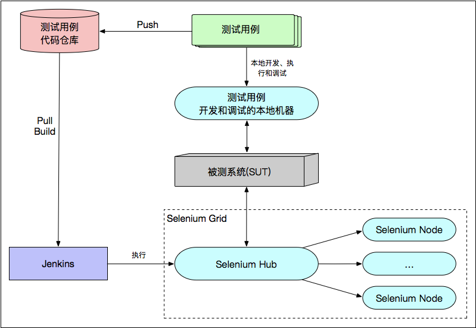
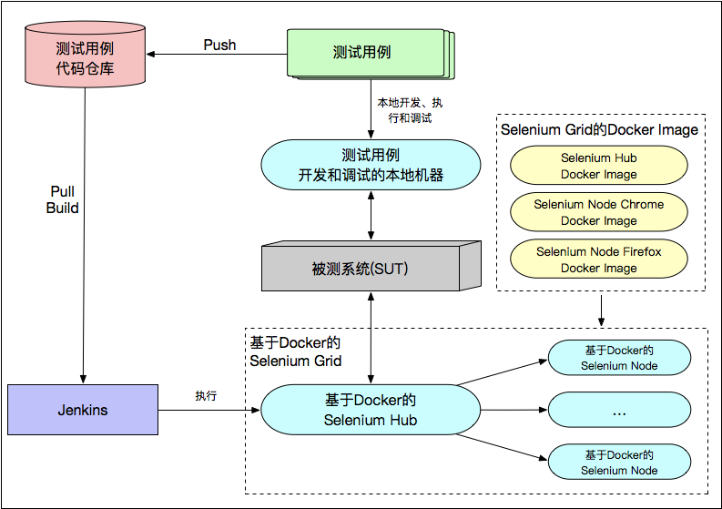
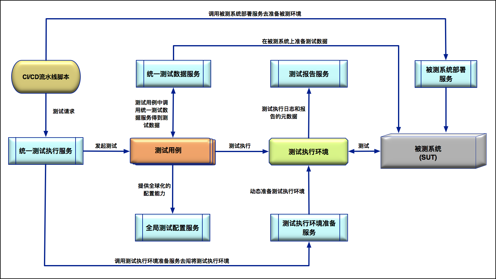

## 基础架构

测试基础架构主要包括以下内容：

1. 执行测试的机器；
2. 测试用例代码仓库；
3. 发起测试执行的 Jenkins Job；
4. 统一的测试执行平台；
5. 测试用例执行过程中依赖的测试服务，比如提供测试数据的统一测试数据平台、提供测试全局配置的配置服务、生成测试报告的服务等；

Selenium Grid 就是一种可以并发执行 GUI 测试用例的测试执行机的集群环境

### 经典的测试基础架构

### 基于 Docker 实现的 Selenium Grid 测试基础架构

第一，测试用例的版本化管理。我们都知道，应用的开发有版本控制机制，即：每次提测、发布都有对应的版本号。所以，为了使测试用例同样可追溯，也就是希望不同版本的开发代码都能有与之对应的测试用例，很多大型企业或者大型项目都会引入测试用例的版本化管理。最简单直接的做法就是，采用和开发一致的版本号。比如，被测应用的版本是 1.0.1，那么测试用例的版本也命名为 1.0.1。在这种情况下，当被测应用版本升级到 1.0.2 的时候，我们会直接生成一个 1.0.2 版本的测试用例，而不应该直接修改 1.0.1 版本的测试用例。这样，当被测环境部署的应用版本是 1.0.1 的时候，我们就选择 1.0.1 版本的测试用例；而当被测环境部署的应用版本是 1.0.2 的时候，我们就相应地选择 1.0.2 版本的测试用例。所以，我们就在这个统一的测试执行平台中，引入了这种形式的测试用例版本控制机制，直接根据被测应用的版本自动选择对应的测试用例版本。

第二，提供基于 Restful API 的测试执行接口供 CI/CD 使用。这样做的原因是，测试执行平台的用户不仅仅是测试工程师以及相关的产品经理、项目经理，很多时候 CI/CD 流水线才是主力用户。因为，在 CI/CD 流水线中，每个阶段都会有不同的发起测试执行的需求。我们将测试基础架构与 CI/CD 流水线集成的早期实现方案是，直接在 CI/CD 流水线的脚本中硬编码发起测试的命令行。这种方式最大的缺点在于灵活性差：当硬编码的命令行发生变化，或者引入了新的命令行参数的时候，CI/CD 流水线的脚本也要一起跟着修改；当引入了新的测试框架时，发起测试的命令行也是全新的，那么 CI/CD 流水线的脚本也必须被一起改动。

### 大型全球化电商网站的全局测试基础架构设计

1. 统一测试执行服务

   > 以 Restful API 的形式对外提供测试执行服务

- 测试版本管理
- Jenkins测试Job管理
- 测试执行结果管理

2. 统一测试数据服务

   > 通过 Restful API 调用统一测试数据服务，然后由它在被测系统中实际创建或者搜索符合要求的测试数据。

   - 引入自己的内部管理仓库管理测试元数据
   - 有效测试数据数量自动补全
   - 测试数据质量监控

3. 测试执行环境准备服务

   > 特指具体执行测试的测试执行机器集群：对于 GUI 自动化测试来说，指的就是 Selenium Grid；对于 API 测试来说，指的就是实际发起 API 调用的测试执行机器集群。

4. 被测系统部署服务

   > 主要被用来安装部署被测系统和软件。
   
5. 测试报告服务

   > 通过引入一个 NoSQL 数据库，以存储的测试报告元数据的方式去实现。

6. 全局测试配置服务

   