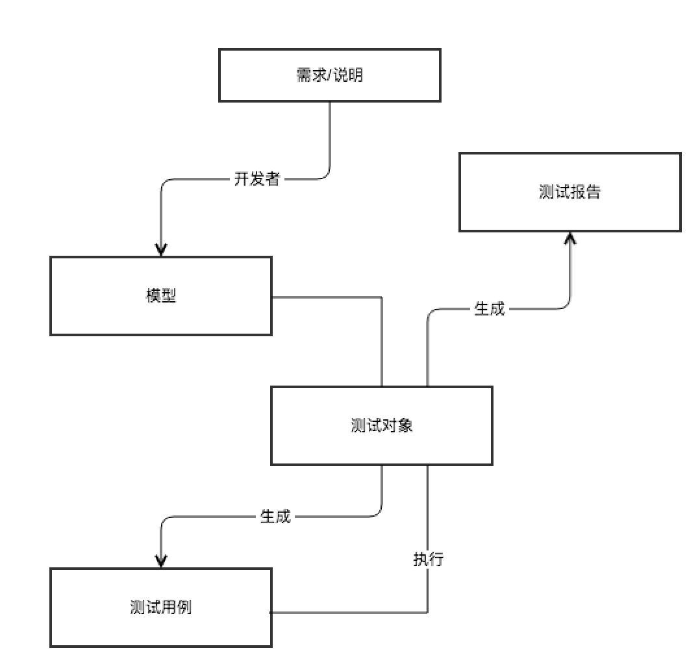

## 测试新技术

### 探索式测试

依靠测试工程师的经验和直觉测试。在探索式测试中，测试工程师不断提出假设，通过测试执行去检验假设，通过解读测试结果证实或推翻假设。在这个迭代过程中，测试工程师不断完善头脑中被测试应用的知识体系，并建立被测应用的模型，然后利用模型、过往经验，以及测试技术驱动进一步的测试。

### 测试驱动开发

TDD 的整个过程遵循以下流程：

1. 为需要实现的新功能添加一批测试；
2. 运行所有测试，看看新添加的测试是否失败；
3. 编写实现软件新功能的实现代码；
4. 再次运行所有的测试，看是否有测试失败；
5. 重构代码；重复以上步骤直到所有测试通过。

所有人员参与需求评审 -> 测试人员编写测试用例 -> 所有人员参与用例评审 -> 开发人员按照测试用例进行编码 -> 开发人员执行用例，进行自测，所有用例通过后 -> 开发人员提测 -> 测试人员进行测试。

### 精准测试

所谓精准测试，就是借助一定的技术手段、通过算法的辅助对传统软件测试过程进行可视化、分析以及优化的过程。也就是说，精准测试可以使得测试过程可视、智能、可信和精准。

星云测试：http://www.threadingtest.com/index.html

https://cloud.tencent.com/developer/article/1158398

https://cloud.tencent.com/developer/article/1165676

### 渗透测试

> 渗透测试指的是，由专业安全人员模拟黑客，从其可能存在的位置对系统进行攻击测试，在真正的黑客入侵前找到隐藏的安全漏洞，从而达到保护系统安全的目的。

Nmap、Aircrack-ng、SQLmap、Wifiphisher、AppScan 

### 基于模型的测试

MBT 的基本原理是通过建立被测系统的设计模型，然后结合不同的算法和策略来遍历该模型，以此生成测试用例的设计。

MBT 的一般过程

执行 MBT 的过程就好比你把软件系统的设计画为了一张由节点和边构成的数据结构意义上的“图”，然后通过一定的算法（比如，深度遍历或者广度遍历）来尽可能完整覆盖图中全部的可能路径的过程。

### 常用模型介绍

1. 有限状态机

   有限状态机可以帮助测试人员根据选中的输入来评估输出，不同的输入组合对应着不同的系统状态。在登录系统这个例子中，员工在未登录时的状态是“未登录”，一旦登录成功状态就会变为“已登录”。在已登录的状态下，员工可以访问各类资源，使用系统内的工具。

2. 状态图

   状态图是有限状态机的延伸，用于描述系统的各种行为，尤其适用于复杂且实时的系统。状态图有一定数量的状态，系统的行为可以以事件的方式来驱动状态的变化。比如，缺陷管理工具中出现了缺陷，其初始状态为“new”；缺陷被开发人员修复后，就必须将其改为“Fixed”；但是，如果此时测试人员发现缺陷并未修复或者只是部分修复时，则需将状态更改为“Reopen”（重新打开）。状态图的设计方式，要求为每个不同的状态创建一个事件。

3. UML

   UML 即统一建模语言，是一种标准化的通用建模语言。UML 有自己定义的图形库，里面包含了丰富的图形用以描述系统、流程等。

工具：BPM-X、fMBT、GraphWalker、GSL、JSXM、MaTeLo、MBT Suite 